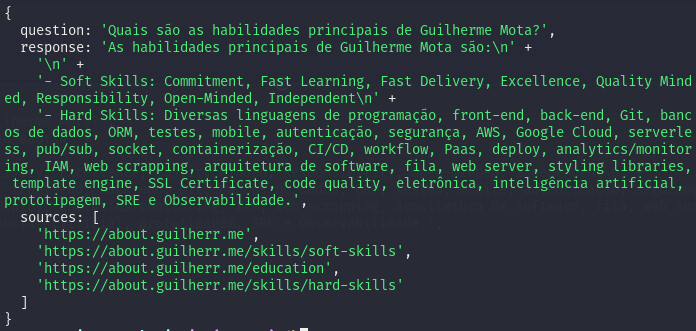

<h3 align="center">
  Semantic Search LLM AI 🤖
</h3>


<p align="center">
	
</p>

## 📌 Overview

That's a simple LLM semantic search that implements RAG concepts with help of LangChain and OpenAI API.

## 🔧 Technologies

- Typescript
- LangChain
- OpenAI API
- Redis Vector Store
- Puppeteer

## ⚠️ In hand polyfills for NodeJS under v18

- ReadableStream
	- **Path:** node_modules/@langchain/core/dist/utils/sax-js/sax.cjs
	- **Lib:** ```npm install web-streams-polyfill```
	- **Import:** ```const { ReadableStream } = require("web-streams-polyfill")```

- ReadableStream
	- **Path:** node_modules/@langchain/core/dist/utils/stream.cjs
	- **Lib:** ```npm install web-streams-polyfill```
	- **Import:** ```const { ReadableStream } = require("web-streams-polyfill")```

- fetch
	- **Path:** node_modules/@langchain/core/dist/utils/async_caller.cjs
	- **Lib:** ```npm install node-fetch```
	- **Import:** ```const fetch = require("node-fetch")```

## 🚀 Getting started

1. Clone this repository
2. Run the following commands
```sh
npm run load
npx run ask
```
